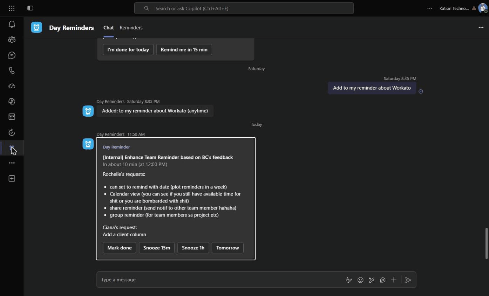
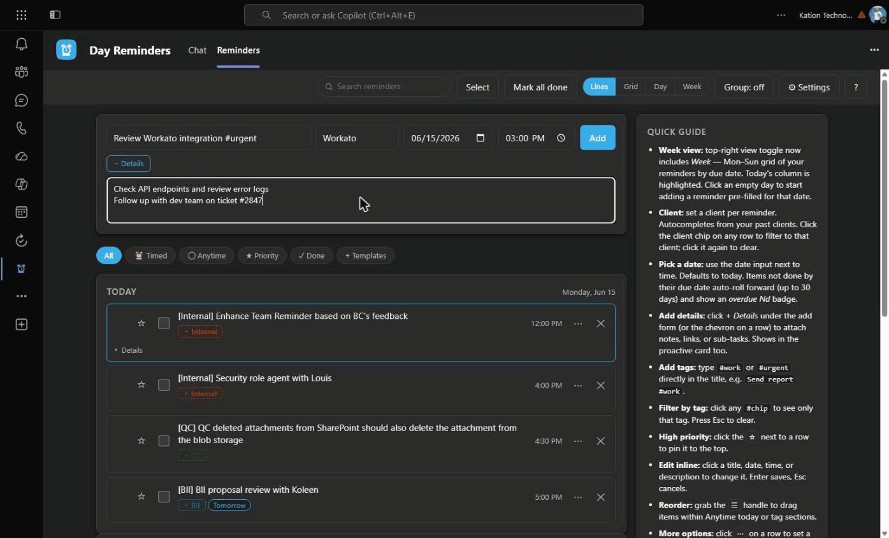
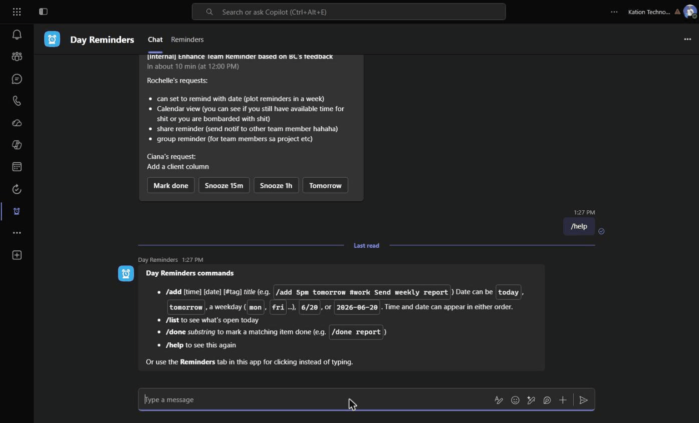
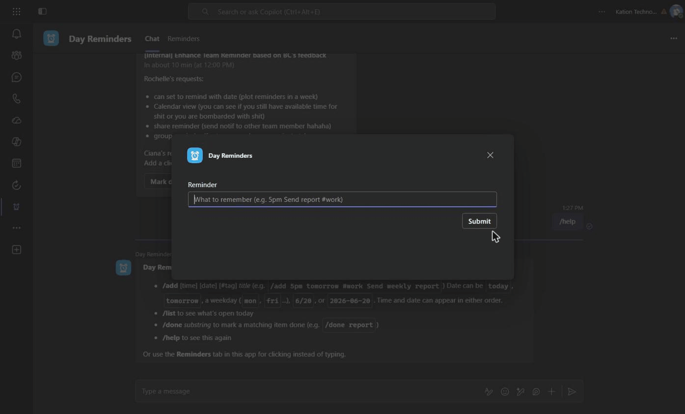
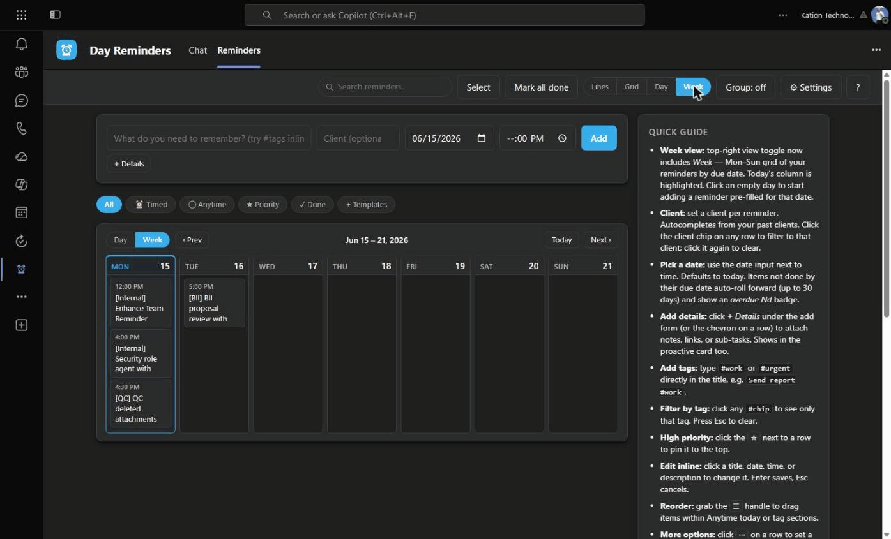
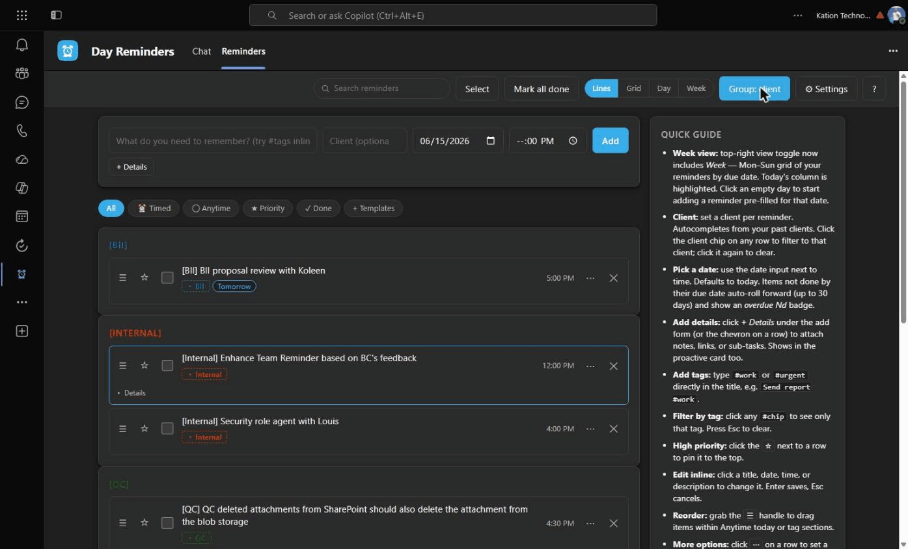
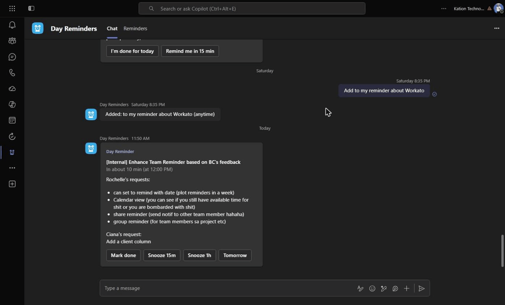

# Day Reminders — User Guide

Day Reminders is a personal productivity surface that lives inside Microsoft Teams. Capture what you need to remember today (or any day), and the bot pings you in chat before each one. You never have to leave Teams.

> Current version: **v1.4.6**.

---

## 1. Where to find it

Open Microsoft Teams. In the left rail, look for the **Day Reminders** alarm-clock icon. Click it to open the app.

You'll see two tabs at the top:

- **Reminders** — the main UI where you add, edit, view, and organize.
- **Chat** — your private chat with the Day Reminders bot, where the proactive cards land and where slash commands work.



---

## 2. Adding a reminder

There are three ways:

### a) From the Reminders tab

The add form sits at the top of the tab:

- **Title** — what to remember. You can add `#tags` directly in the title (e.g. `Send report #work`).
- **Client** — optional. Tracks which engagement this is for (e.g. `Citadel`, `NAVCo`). Autocompletes from past clients you've used.
- **Due date** — defaults to today. Pick any other date.
- **Time** — optional. Leave blank for an "anytime today" item.
- **+ Details** — click to reveal a notes field for sub-tasks, links, context (up to 2000 characters).

Press **Add** (or hit Enter in the title field).



### b) From bot chat (slash command)

In the Day Reminders **Chat** tab, type:

```
/add 5pm tomorrow #work Send weekly report
```

- The first 1–2 tokens can be a time (`5pm`, `17:00`) and/or a date (`today`, `tomorrow`, `mon`, `fri`, `6/20`, `2026-06-20`) in either order.
- Hashtags become tags.
- Everything else is the title.

Other slash commands: `/list`, `/done <substring>`, `/help`.



### c) From any Teams chat (compose extension)

In any chat (your bot chat, a 1:1, a channel), click the **`...`** button under the message box, pick **Day Reminders → Quick add reminder**, type the reminder, and submit. Same parsing as `/add`.

Great for when you're mid-conversation and remember something.



---

## 3. Organizing

### Clients

Set a **Client** on a reminder and it shows everywhere as `[Client] Title` (e.g. `[Citadel] Review batch 14`). Each client gets a deterministic color, so the same client always looks the same on every row.

- Click a client chip to filter the list to that client.
- **Shift+click** or **right-click** the chip to inline-edit the client (or clear it).

### Tags

Anything you type in the title prefixed with `#` becomes a tag (`#work`, `#urgent`, `#qc`). Tags get colored chips. Click any chip to filter to that tag.

### Priority

Click the ☆ next to any row to mark it high priority. Pinned to the top of the list.

### Dates and rollover

Every reminder has a **due date** (defaults to today). If you don't tick it done by end of day, it auto-rolls forward to today's list with an **overdue Nd** badge (cap 30 days — anything older stays where it is and won't pollute today).

---

## 4. Viewing

The top-right segmented control switches between four views:

- **Lines** — classic row-by-row list. Best for triage.
- **Grid** — compact card grid. Best for a glance summary.
- **Day** — hour-by-hour timeline of today only. Best for time-blocking.
- **Week** — Mon–Sun grid of reminders by due date. Today's column highlighted. Best for "how bombarded am I this week?"

Shortcut: press **`v`** to cycle through views.

![Lines view — the default row-by-row list, today's items with [Client] prefixes and colored tag chips](screenshots/03-lines-view.png)



### Group toggle

Next to the view switcher, the **Group** button cycles through:

1. **Group: off** — flat list.
2. **Group: tag** — sections per tag, header colored to the tag.
3. **Group: client** — sections per client, header colored to the client.

Shortcut: press **`g`**.

### Quick filters

Above the list, a row of pills: **All / Timed / Anytime / Priority / Done**. Click to narrow what's visible.



---

## 5. Editing

- Click any **title**, **date**, **time**, or **client chip** on a row to edit it inline. Enter saves, Esc cancels.
- Click the chevron / `Details` element under a row to expand and read the description; click the description text to edit.
- Click `⋯` on a row to open **Row options**, where you can set a custom lead time for that reminder and add/edit its description.
- In Lines view, drag the `☰` handle to reorder.

---

## 6. Notifications

When a timed reminder is due (or `leadMinutes` before, default 10 min), the bot sends you an **Adaptive Card** in chat with:

- **Mark done** — closes the reminder.
- **Snooze 15m / 1h / Tomorrow** — push it out. "Tomorrow" also advances the due date so the rollover doesn't double-count.

If the reminder has a description, it shows below the title.

You also get a **Teams Activity Feed notification** (the bell icon) when a reminder fires.

At your configured **End-of-day** time (Settings → "End-of-day check-in time"), the bot sends an "Are you done?" card listing any reminders still open.



---

## 7. Settings

Click the **⚙ Settings** button (top-right). You can change:

- End-of-day check-in time
- Default lead time before each timed reminder (in minutes)
- Weekdays only (skip Sat/Sun for the EOD card)
- Notifications on/off
- Appearance: match Teams theme, or lock to Light/Dark/High-contrast

---

## 8. Tips and shortcuts

| Shortcut | What it does |
|---|---|
| `/` | Focus the add field |
| `f` | Focus the search box |
| `g` | Cycle Group: off → tag → client |
| `v` | Cycle views: Lines → Grid → Day → Week |
| `?` | Open the quick guide |
| `Esc` | Clear filters / cancel edit |

Other tips:

- **Select multiple** — click `Select` in the top bar to enter bulk mode. Tick several rows, then bulk-done, bulk-delete, or toggle star.
- **Templates** — click `+ Templates` (above the list) for a curated set of common reminders, one click to add.
- **Search** — type in the search box (top bar) to match title, tags, or client. Persists across reloads.
- **Undo delete** — when you delete, a toast lets you undo within 5 seconds.

---

## 9. Feedback

Found a bug, want a feature? Drop a note in the team chat or ping Joshua directly.

The next planned release (**v1.5**) adds **sharing** — you'll be able to share individual reminders with anyone in the tenant, and configure per-tag default share lists (e.g. `#QC = [Benex, Tim]` so any reminder tagged `#QC` auto-shares with the team).
